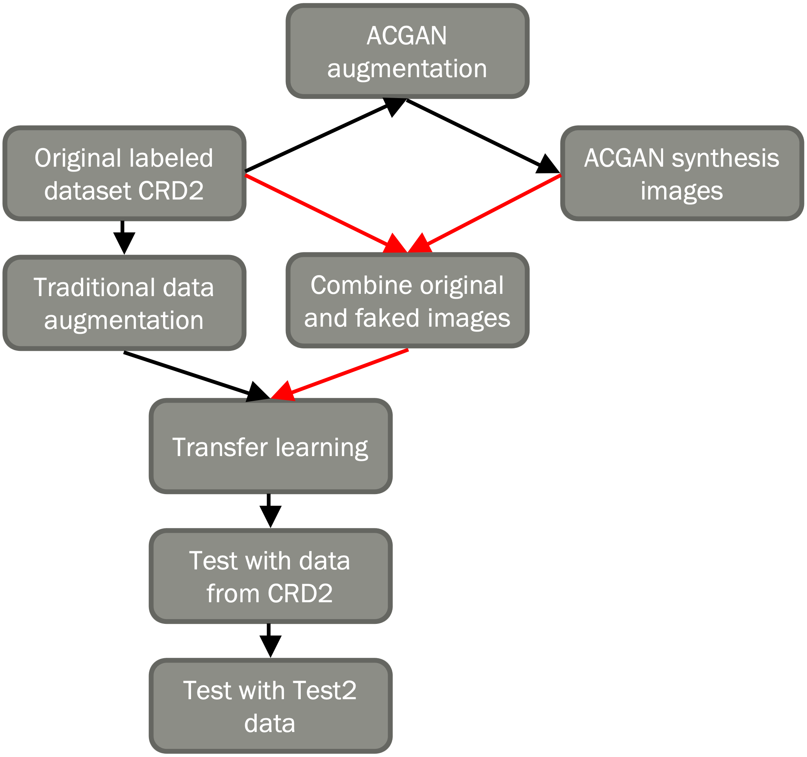
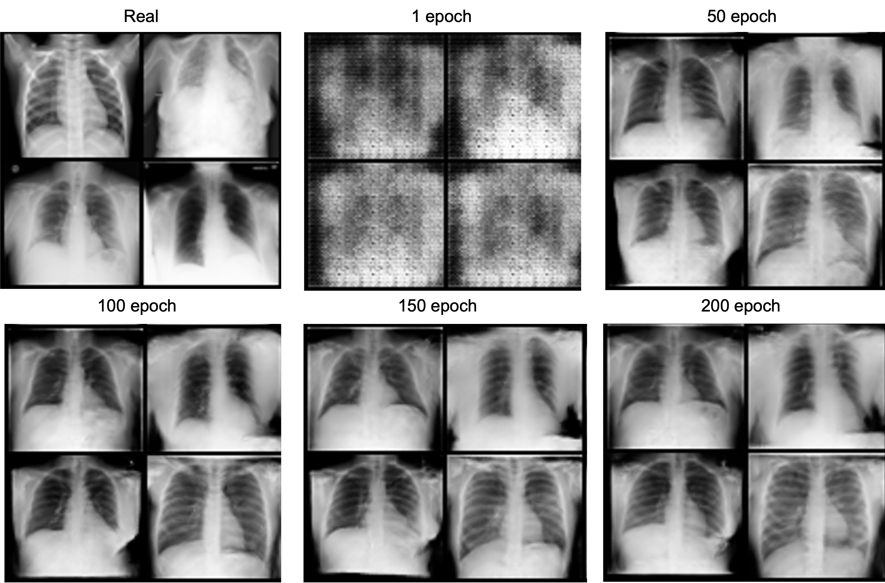

## Assessing transfer learning for COVID-19 x-ray image classification: investigating model performance and generalizability
COVID-19 is a severe respiratory disease that has caused a worldwide pandemic in the past three years, resulting in large-scale social and economic consequences. The symptoms include fever, cough, shortness of breath, fatigue, sore throat, etc. Coronavirus infections are common in the upper respiratory tract, and serious infections can progress to acute respiratory distress syndrome (ARDS), leading to organ damage such as lung damage. The chest X-ray is one of the most commonly utilised tools in COVID-19 detection. However, due to limited resources and a large number of illnesses, other diagnosis procedures must be developed. Deep transfer learning is one of the methods for assisting with rapid diagnosis. This study developed a method for COVID-19 classification utilising chest X-ray images, with two classes: COVID-19 positive and accuracy. Four fine-tuned CNN models were trained with data augmentation techniques: VGG16, VGG19, ResNet50, and InceptionV3. To generate synthesis images, an ACGAN model was also trained. Overall, the models obtained above 0.99 in accuracy, AUC, precision, and recall during training and more than 0.97 during validation, except for the ResNet50. For future work, I would like to generate more X-ray images using the learned ACGAN model and merge them with the original dataset to train and fine-tune the CNN models, In the future, I would want to generate more X-ray pictures using the trained ACGAN model and merge them with the original dataset to train and fine-tune the CNN models, as well as compare the performance metrics and model generalizability to when just traditional data augmentation approaches are employed.

### The experiment design

  

[Original dataset CRD2](https://bimcv.cipf.es/bimcv-projects/bimcv-covid19/#1590858128006-9e640421-6711)
[Test 2 dataset](https://www.kaggle.com/datasets/mrtejas/covid-19-and-normal-x-ray-dataset-balanced)

### Some examples of ACGAN generated images during training

  

